### Live Site URL: https://msamarpanraj.github.io/berachah-church/index.html

## Project Background:


Berachah Good News Baptist Church Website is an online platform designed to offer comprehensive information and resources about the Berachah Good News Baptist Church. This website aims to serve as an informative hub for both the church community and visitors, providing insights into the church's history, beliefs, and founders of the church.

The inspiration behind the Berachah Good News Baptist Church Website stems from the desire to create an accessible and informative online presence for the Berachah Good News Baptist Church. In today's digital age, having an online platform is essential for churches to connect with their congregation and reach out to a broader audience.

Several key factors:

1. Digital Engagement in Faith Communities: In recent years, faith communities have increasingly recognized the importance of establishing an online presence to engage with their members and the wider community. The Berachah Good News Baptist Church seeks to adapt to these changing times by providing an easily accessible digital platform.

2. Church Information and History: The website aims to offer a detailed account of the church's history, its founders, and its current pastor. This historical context helps strengthen the church's identity and provides visitors with valuable insights into its origins and spiritual journey.

3. Doctrinal Clarity: The Doctrinal Statement section of the website offers a comprehensive overview of the church's beliefs and theological positions. This serves as a reference point for both existing members and those interested in learning more about the church's core doctrines.

4. Church Timings: In an effort to inform the users about the timings and other programs conducted by the church, the website includes Join us section on the homepage. This section showcases church timings, weekly programs and a link to youtube channel where users can watch the live stream of the church.

5. Contact and Communication: The Contact section allows users to connect with the church directly. Whether someone has questions, wants to attend an event, or seeks guidance, this section facilitates communication between the church and its members and visitors.

The Berachah Good News Baptist Church Website project recognizes the evolving nature of community engagement and aims to cater to the digital needs of its congregation and the broader online community interested in the church's mission and teachings. By providing this online platform, the church seeks to promote its values and extend its reach, ultimately fostering spiritual growth, connection, and community engagement.


## Aim

The aim of the Berachah Good News Baptist Church Website project is to create an accessible online platform that informs and engages both the church community and visitors, fostering a deeper understanding of the church's history, timings, contact details, beliefs, and values in today's digital age.


### User Goals

* Easily navigate the website for information
* Discover the history and mission of Berachah Good News Baptist Church
* Locate the church's address and service timings
* Contact the church and inquire about attending services or events
* Explore details about the founders and pastors of the church
* Understand the core beliefs and doctrines of the church
* Get insights into what to expect when visiting Berachah Good News Baptist Church for the first time.

[Back to top ⇧]

## User Stories

### Current User Goals

1. **Contact Information:** As a current user, I want to easily find contact information for the church to inquire about upcoming events or services.

2. **Efficient Navigation:** As a current user, I want to navigate the website efficiently and access specific information about the church's history and beliefs.

3. **Content Accessibility:** As a current user, I want a straightforward way to access content I've previously viewed on the website.

### New User Goals

1. **Intuitive Navigation:** As a new user, I want to intuitively navigate the entire website, making it easy to explore and discover relevant information.

2. **Understanding Purpose:** As a new user, I want to quickly grasp the primary purpose, doctrinal statements and founders of Berachah Good News Baptist Church through clear and concise content.

3. **Relevant Information:** As a new user, I expect information to be readily available and relevant, helping me understand the church's background, timings, and values.

4. **Appealing Visuals:** As a new user, I appreciate attractive visuals and a color scheme that complements the website's content and enhances the overall experience.

5. **Contact/Inquiry:** As a new user, I want a hassle-free process to contact the church or inquire about attending services and events.

### Development-Planes

To create a comprehensive website that fulfills the user stories outlined earlier and identifies the functionality of the site.


### Strategy

Strategy incorporates user needs as well as . This website will focus on the following target audience:

- **User Roles:**
  - Current Church Members
  - New Visitors

- **Demographics:**
  - All age groups
  - Residents of Telangana, India
  - Individuals new to our church or seeking information about our services

The website will provide users with the ability to:

  - Easily access essential information, including:
  - Details about the church's services and activities
  - Insights into our church's founders and pastors
  - What to expect during their first visit
  - Contact options for inquiries or appointments
  - Location details of the church
  - Connect with us on social media platforms

## Features

### Navigation Bar
- The website features a responsive Navigation Bar that adapts seamlessly to various devices, prioritizing a 'mobile-first' design approach. 
- On mobile devices, it includes a clickable burger icon with a dropdown menu for easy navigation. 
- As users transition to tablet and monitor sizes, the burger icon transforms into a traditional navigation bar, offering options to explore the 'Home,' 'About Us,' 'Gallery,' and 'Contact Us' pages.
- To enhance user experience, the Navigation Bar maintains a logical order of links based on importance. The 'About Us' page, containing crucial content users are most likely to engage with, is strategically positioned ahead of the 'Gallery' and 'Contact Us' links.
- In line with UX best practices, users can conveniently return to the Home page by clicking the dedicated 'Home' link in the Navigation Bar. This redundancy ensures ease of navigation and accessibility.
- To provide users with clear visual cues during their site exploration, the active page they are on is highlighted with an underline effect in the Navigation Bar. This visual distinction aids users in orienting themselves within the website.

Mobile navigation bar with burger menu


Navigation Bar in Desktop view


## Technology

### Languages

- HTML
- CSS

### Frameworks & Tools

- [Git](https://git-scm.com/)
- [GitHub](https://github.com/)
- [Code Anywhere Cloud IDE](https://app.codeanywhere.com/)
- [Balsamiq](https://balsamiq.com/wireframes/)
- [Favicon](https://favicon.io/favicon-generator/#google_vignette)
- [Paletton](https://paletton.com/)
- [Google Fonts](https://fonts.google.com/)
- [Font Awesome](https://fontawesome.com/)
- [W3C Markup Validation Service](https://validator.w3.org/)
- [W3C CSS Validation Service](https://jigsaw.w3.org/css-validator/)
- [Google Lighthouse](https://chrome.google.com/webstore/detail/lighthouse/blipmdconlkpinefehnmjammfjpmpbjk)
- [Chrome DevTools](https://developer.chrome.com/docs/devtools/)
- [Google Maps](https://www.google.com/maps)
- [YouTube](https://www.youtube.com/)
- [TinyJPG](https://tinyjpg.com/)
- [Freeconvert JPG to webp](https://www.freeconvert.com/jpg-to-webp)
- [Wave Accessesibility](https://wave.webaim.org/)
- [Pixelied](https://pixelied.com/convert/jpg-converter/jpg-to-webp)
- [Svgrepo](https://www.svgrepo.com/)
- 
### Accessibility
[Wave Accessibility](https://wave.webaim.org/) tool was eery helpful during the developemnt of the website. I was able check for any aid accessibility testing and fix the issues it showed.

Initially #BF8F02 color code was used for headings however when auditing site with wave, the color contrast failed and then the color code swapped with #926e02. Likewise the wave accesibility test helped to maintain the contrast ratio through the site.

- **0 errors in wave test:**

Likewise, all the pages tested with wave accessibility tool and all passed with zero errors.


### Lighthouse Testing
- **Home page:**
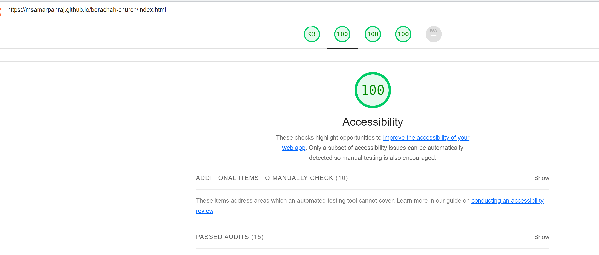
- **About us:**
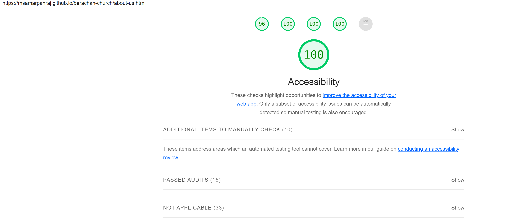
- **Gallery:**
- **Before Optimizations:**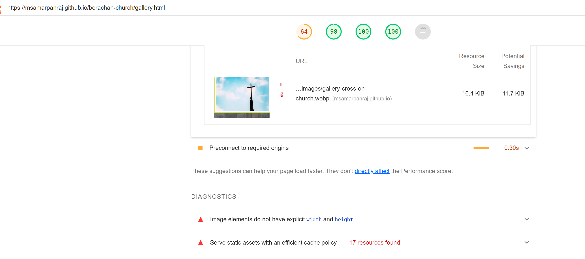
- **After Optimizations:** After Optimizations and fixing issues
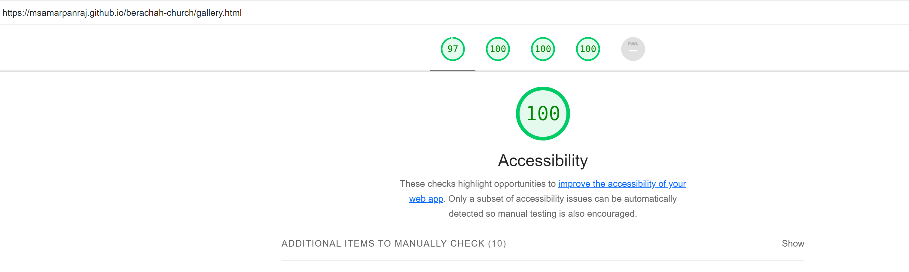
- **Contact Page:**
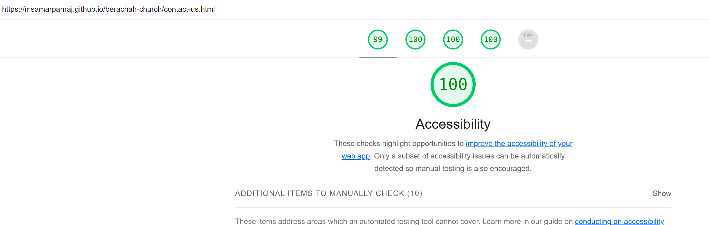

Optimized the site to achieve a score of 100 for accessibility, best practices and SEO for all of the pages. However the performance metric is lower than the other metrics due to issues like Serve static assets with an efficient cache policy . For the further projects will aim to optimize the performacce metric as well. However the current score is still good for all pages for performance metric.

### Validator Testing

## HTML

Thorough validation testing conducted using the [W3C validator](https://validator.w3.org/) for all the HTML pages of the project. The results of the testing, along with screenshots for each page, are as follows:

### Index.html

- **Validation Result:** 0 errors
- **Screenshot:**
  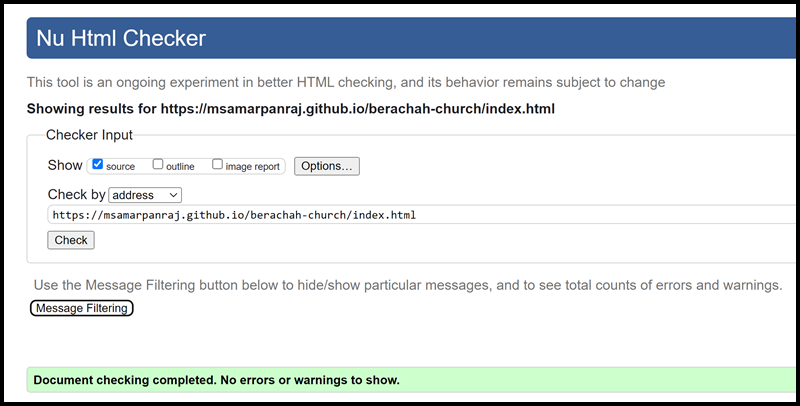

### About-us.html

- **Validation Result:** 0 errors
- **Screenshot:**
  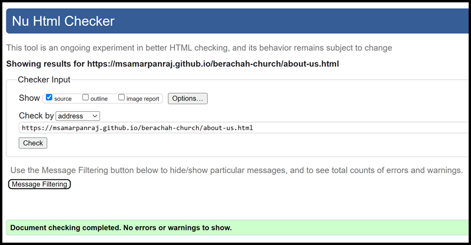

### Gallery.html

- **Validation Result:** 0 errors
- **Screenshot:**
  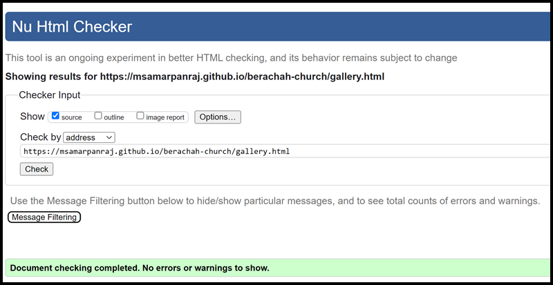

### Contact-us.html

- **Validation Result:** 0 errors
- **Screenshot:**
  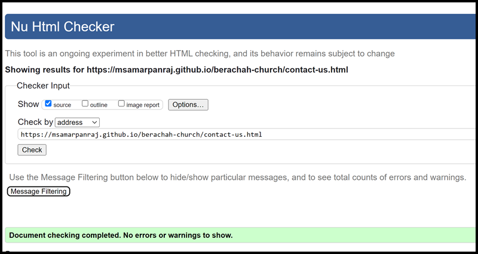

### Thank you.html

* **Validation Result:** 0 errors
- **Screenshot:**
  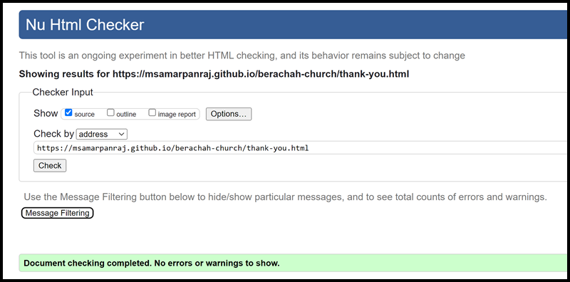

### 404.html

* **Validation Result:** 0 errors
- **Screenshot:**
  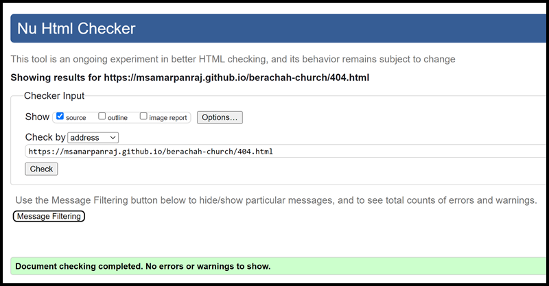
...

This ensures that my HTML code adheres to industry standards, as confirmed by the W3C validator, and each page is free from any syntax or markup errors. You can review the screenshots above to see the clean validation reports for each page. A clean validation report indicates that the web pages are well-structured and compatible with various web browsers, contributing to a seamless user experience.

## CSS
No errors or warnings found when tested with [W3C CSS Validator](https://jigsaw.w3.org/css-validator/)
- **Validation Result:** 0 errors
- **Screenshot:**
  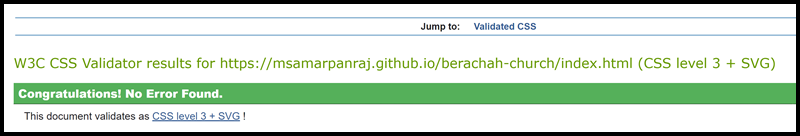


## Deployment

### Version Control

The site was created using the CodeAnywhere code editor and which was conneced to github. A new workspace is imported to codeanywhere from github repositories and the following is the repository which this project was associated.
https://github.com/msamarpanraj/berachah-church

During development, the following Git commands were utilized to manage code updates:

```git add <file>``` - This command added specific file(s) to the staging area for the next commit.
```git commit -m “commit message”``` - It was used to commit changes to the local repository, preparing them for the final step.
```git push``` -  This command pushed all committed code to the remote repository on GitHub.

### Steps to deply website to Github Pages

### Deploying the Website to GitHub Pages
- The website was deployed to GitHub Pages using the following steps:
 - In the GitHub repository, go to the "Settings" tab.
 - From the left-side menu, select 'Pages.'
 - In the source section drop-down menu, choose the 'main' branch.
 - Click 'Save.'
 - Upon successful publishing, a live link will be displayed in a green banner.


### Steps for cloning the repository

1. Click on the "Code" button near the top right corner of the page.
2. Copy the HTTPS or SSH URL that appears in the box.
3. Open your terminal (or Git Bash on Windows) and navigate to the directory where you want to clone the repository.
4. Type "git clone" followed by a space, and then paste the URL you copied in step 3.
5. Press enter to run the command. This will clone the repository onto your local machine.
6. You should now have a local copy of the GitHub repository on your machine.

### Cloning the Repository
1. To clone the repository to your local machine, follow these steps:
- Click on the "Code" button located near the top right corner of the page.
- Copy the HTTPS or SSH URL displayed.
- Open your terminal (or Git Bash on Windows) and navigate to your desired directory.
- Enter "git clone" followed by a space, and paste the copied URL.
- Press enter to execute the command, creating a local copy of the GitHub repository.
2. You now have the GitHub repository cloned to your local machine.

### Forking the Repository
1. Fork the repository by following these steps:

2. Click the "Fork" button found near the top right corner of the page. This duplicates the repository into your GitHub account.
3. After forking, you will be redirected to your forked repository.
4. If not already done, clone the forked repository to your local machine, using the instructions mentioned earlier.
5. Make any desired changes or additions to the code in your local copy of the repository.
6. Commit your changes to your local repository using the "git commit" command.
7. Push your changes to the forked repository on GitHub with the "git push" command.
8. If you intend to contribute your changes back to the original repository, initiate a pull request. You can do this by going to the original repository's page and selecting the "New pull request" button. From there, you can compare your changes to the original repository and request a merge.
9. You now have a forked copy of the GitHub repository in your account, allowing you to make changes and contribute back to the original repository if desired.

# Credits
## Images/Content

- https://www.pexels.com/photo/silhouette-of-cross-1343325/
- https://www.pexels.com/photo/a-woman-in-black-sweater-9577187/
- https://www.pexels.com/photo/photo-of-man-holding-holy-bible-7468196/
- https://www.pexels.com/photo/bible-blur-christ-christianity-372326/
- https://www.pexels.com/photo/people-standing-in-the-church-during-a-ceremony-8270597/
- https://www.pexels.com/photo/a-group-of-people-singing-during-a-ceremony-16721671/
- https://www.pexels.com/photo/man-praying-among-people-on-gathering-16618400/
- https://www.pexels.com/photo/women-praying-in-a-church-17898825/
- https://www.pexels.com/photo/people-praying-on-gathering-17898885/
- https://www.pexels.com/photo/selective-focus-photo-of-person-holding-book-2351719/
- https://www.pexels.com/photo/fashion-man-people-woman-8815215/

## Favicon
- [Favicon Generator](https://favicon.io)

## Other
- Colour palette [Paletton](https://paletton.com/)
- SVG icons: [SVGRepo](svgrepo.com)
- Fonts: [Google Fonts](https://fonts.google.com/)
  
## Educational resources
- [Learntheweb](https://learntheweb.courses/)
- [W3Schools](https://www.w3schools.com/)
- [Youtube](https://youtube.com)

The Hamburger Menu, Hero section, Gallery Code and boilerplate template was take from Love Running v3 project and highly customized to my project needs.

# Acknowledgements

I successfully finished this project as part of my Portfolio Project 1 submission for the Full Stack Web Developer (eCommerce) Diploma program at the Code Institute. I extend my heartfelt appreciation to my mentors, Dario and Daisy, as well as the entire Code Institute team and the supportive Slack community for their invaluable assistance and encouragement during the course of this project.